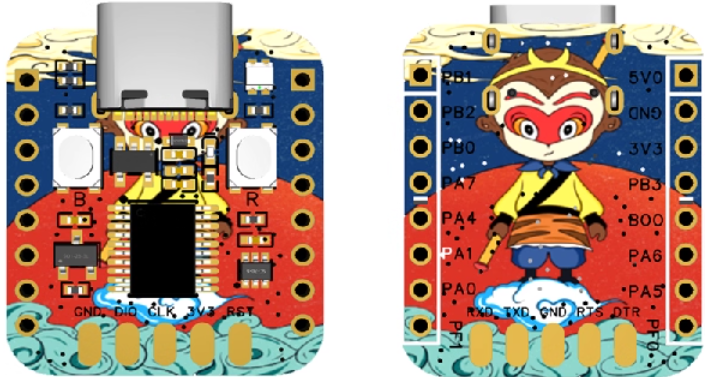

# Air001_WS2812
Air001上的WS2812LED灯珠点亮Arduino示例程序


# Air001_WS2812 Library

*WS2812 LED Arduino control for LuatOS Air001 development boards*

## 简介

这个 Arduino 库提供简单高效的方法来控制合宙 Air001 开发板上的 WS2812 RGB LED。通过封装底层 SPI 通信协议，开发者可以轻松实现各种灯光效果，而无需关心复杂的时序控制细节。

## 特性

- 🚀 即插即用 - 无需额外硬件接线
- 🎨 支持 1600 万色显示（24位 RGB）
- ⚡ 基于硬件 SPI 的高效控制
- 📚 预定义常用颜色常量
- 🌈 包含呼吸灯、颜色过渡等效果示例
- 🔧 适用于所有基于 Air001 的开发板

## 硬件要求

- 合宙 Air001 开发板（或兼容板）
- 板载 WS2812 RGB LED（已连接至 PA7 引脚）

## 安装方法

### 手动安装

1. 下载 [最新版本库文件](https://github.com/zhaochenghua/Air001_WS2812)
2. 解压到 Arduino 库目录：
   - Windows: `文档\Arduino\libraries\`
   - Mac: `~/文档/Arduino/libraries/`
   - Linux: `~/Arduino/libraries/`
3. 重启 Arduino IDE

## 快速开始

```cpp
#include <Air001_WS2812.h>

void setup() {
  Air001_WS2812::begin();  // 初始化LED控制器
}

void loop() {
  // 设置预定义颜色
  Air001_WS2812::setColor(Air001_WS2812::RED);
  delay(1000);
  
  // 使用十六进制颜色值
  Air001_WS2812::setColor(0x00FF00); // 绿色
  delay(1000);
  
  // 使用RGB分量 (红, 绿, 蓝)
  Air001_WS2812::setColor(255, 165, 0); // 橙色
  delay(1000);
  
  // 关闭LED
  Air001_WS2812::off();
  delay(1000);
}
```

## API 参考

### 初始化函数

| 函数 | 描述 |
|------|------|
| `Air001_WS2812::begin()` | 初始化LED控制器，应在setup()中调用 |

### 颜色控制函数

| 函数 | 描述 |
|------|------|
| `setColor(uint32_t rgb)` | 设置颜色 (0xRRGGBB格式) |
| `setColor(uint8_t r, uint8_t g, uint8_t b)` | 设置颜色 (RGB分量 0-255) |
| `off()` | 关闭LED |

### 预定义颜色常量

```cpp
Air001_WS2812::RED     // 红色 (0xFF0000)
Air001_WS2812::GREEN   // 绿色 (0x00FF00)
Air001_WS2812::BLUE    // 蓝色 (0x0000FF)
Air001_WS2812::YELLOW  // 黄色 (0xFFFF00)
Air001_WS2812::PURPLE  // 紫色 (0xFF00FF)
Air001_WS2812::WHITE   // 白色 (0xFFFFFF)
Air001_WS2812::ORANGE  // 橙色 (0xFFA500)
Air001_WS2812::CYAN    // 青色 (0x00FFFF)
Air001_WS2812::BLACK   // 关闭 (0x000000)
```

## 示例程序

库中包含多个示例程序，展示不同效果实现：

1. **SimpleDemo** - 基础颜色循环
2. **ColorTransition** - 平滑颜色过渡
3. **BreathingEffect** - 呼吸灯效果
4. **CustomEffects** - 自定义灯光模式

**访问示例：**
- Arduino IDE: 文件 > 示例 > Air001 WS2812 Control

## 高级用法

### 创建自定义颜色

```cpp
// 粉色 (R=255, G=192, B=203)
Air001_WS2812::setColor(0xFFC0CB);

// 50%亮度的蓝色
Air001_WS2812::setColor(0, 0, 128);
```

### 实现呼吸灯效果

```cpp
void breatheEffect(uint8_t r, uint8_t g, uint8_t b, int speed) {
  // 渐亮
  for (int i = 0; i < 256; i++) {
    Air001_WS2812::setColor(
      map(i, 0, 255, 0, r),
      map(i, 0, 255, 0, g),
      map(i, 0, 255, 0, b)
    );
    delay(speed);
  }
  
  // 渐暗
  for (int i = 255; i >= 0; i--) {
    Air001_WS2812::setColor(
      map(i, 0, 255, 0, r),
      map(i, 0, 255, 0, g),
      map(i, 0, 255, 0, b)
    );
    delay(speed);
  }
}

// 使用呼吸灯效果
breatheEffect(255, 0, 0, 20); // 红色呼吸灯
```

## 常见问题

### LED不亮怎么办？
1. 确认已调用 `Air001_WS2812::begin()` 
2. 检查开发板是否正常工作
3. 尝试重新上传程序

### 颜色显示不正确？
1. 确保使用正确的颜色格式（0xRRGGBB）
2. 检查是否使用了最新的库版本
3. 尝试重置开发板

### 编译错误？
1. 确认已安装 Air001 开发板支持包
2. 检查是否选择了正确的开发板（工具 > 开发板 > Air001）
3. 确保所有必需文件都在库目录中

## 贡献指南

欢迎贡献代码！请遵循以下步骤：
1. Fork 本仓库
2. 创建特性分支 (`git checkout -b feature/your-feature`)
3. 提交更改 (`git commit -am 'Add some feature'`)
4. 推送分支 (`git push origin feature/your-feature`)
5. 创建 Pull Request

## 许可证

本项目采用 **MIT 许可证** - 详情见 [LICENSE](LICENSE) 文件。

## 技术支持

如有任何问题或建议，请：
- 📧 发送邮件至: support@example.com
- 📝 创建 [GitHub Issue](https://github.com/yourusername/Air001_WS2812/issues)
- 💬 加入讨论群: [Telegram Group](https://t.me/air001_support)

---

**让您的 Air001 项目焕发光彩！** ✨